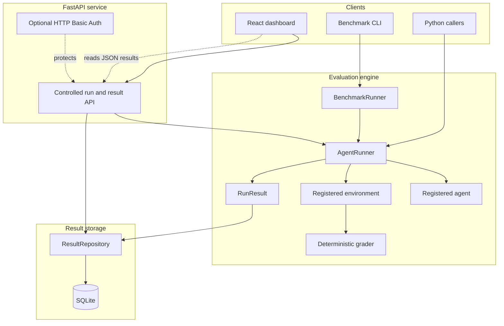
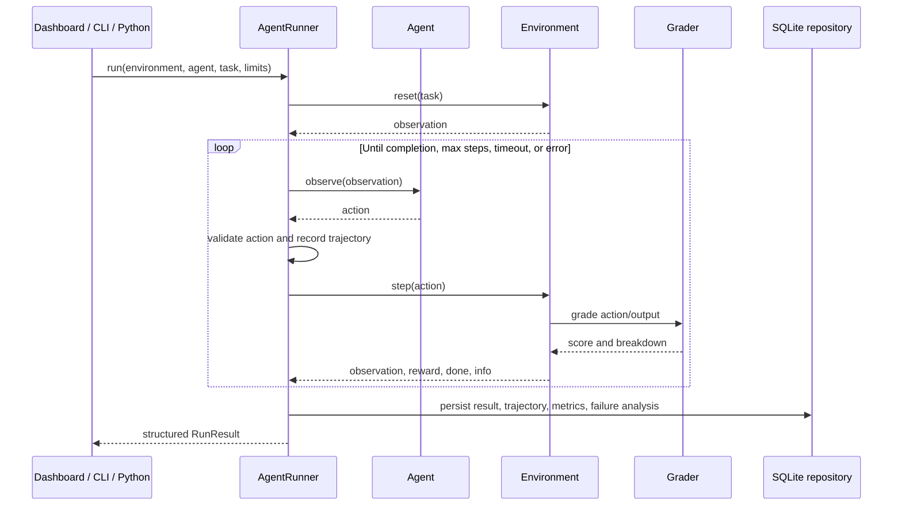

# OpenEnv Workbench

OpenEnv Workbench is a small, deterministic evaluation platform for testing
agents on realistic, non-game tasks. It gives developers one repeatable
execution path from observation to action, deterministic grading, structured
metrics, trajectory capture, benchmark comparison, persistence, and a focused
React dashboard.

## Why it exists

Agent demos often make it difficult to answer basic engineering questions:
which agent succeeded, which task failed, how many steps were wasted, and what
actually happened before termination? This project makes those questions
observable and testable without requiring an LLM for the default test suite.

## Architecture and execution flow



The core loop is:

```text
environment.reset()
  -> observation
  -> agent.observe(observation)
  -> action validation
  -> environment.step(action)
  -> new observation/reward/info
  -> repeat until completion, limit, timeout, or error
```

### Detailed interaction sequence



## What this project does in practical terms

OpenEnv Workbench is an evaluation harness rather than a single chatbot. It
lets you place different agents inside the same controlled tasks and measure
their behavior consistently:

1. An environment presents an observation and task objective.
2. An agent chooses an action.
3. The environment validates and applies the action.
4. A deterministic grader scores the result.
5. `AgentRunner` records steps, timing, errors, actions, observations, and
   termination.
6. `BenchmarkRunner` repeats this process across tasks, runs, or agents.
7. SQLite stores results and the React dashboard makes them inspectable.

This makes the project useful for answering questions such as:

- Did the agent solve the task?
- Which model or agent performed better on the same task?
- Did it fail because of an invalid action, an incorrect answer, a timeout, or
  an environment error?
- How many steps did it use and what happened at each step?

## Environments and tasks

The original OpenEnv environment includes:

- **Email Classification** (`email_classification`, easy)
- **Data Cleaning** (`data_cleaning`, medium)
- **Customer Support** (`customer_support_reply`, hard)

The controlled coding environment includes deterministic Python bug-fixing
tasks:

- `fix_addition`
- `fix_email_normalization`
- `fix_safe_division`

Coding actions are restricted to `list_files`, `read_file`, `edit_file`,
`run_tests`, and `submit`. It does not accept arbitrary shell commands or host
filesystem paths.

## Agents and LLM architecture

Agents implement the small `observe(observation) -> action` interface.
`MockAgent` returns predefined actions and is used for deterministic tests.
`LLMBackedAgent` uses the provider-neutral `LLMProvider` interface.
`OpenAIProvider` is the current OpenAI-compatible provider implementation.
Credentials are read from environment variables and are never written to
results or logs.

## AgentRunner

`AgentRunner` is independently usable from Python and supports synchronous
and asynchronous agents/environments. It validates actions, enforces
`max_steps`, supports cooperative overall timeouts, handles cancellation in
async runs, and returns a structured `RunResult`.

Each result includes:

- completion and termination reason
- final observation/action
- grading summary
- execution metrics
- agent/environment errors
- model and token metadata when provided
- every interaction as a structured trajectory
- deterministic failure categories and primary failure reason

## Deterministic grading and failure analysis

Environment graders produce normalized scores and breakdowns. The runner does
not ask an LLM to judge failures. Failure categories are derived from
validated runner/environment facts, including invalid actions, agent errors,
environment errors, constraint violations, incorrect output, incomplete
tasks, timeouts, and repeated failed actions.

## Benchmarks and multi-agent comparison

`BenchmarkRunner` runs one or more tasks repeatedly through `AgentRunner`.
Configurations specify the environment, tasks, registered agent(s), step
limit, timeout, run count, and optional seed. Aggregates include success rate,
average score, average steps, average execution time, failure rate, timeout
rate, failure categories, repeated actions, and wasted steps.

Multiple registered agents can be compared on the same tasks and evaluation
settings. Results can be exported to JSON or CSV.

Example:

```bash
python -m benchmark.cli run \
  --environment openenv \
  --tasks email_classification \
  --agents mock \
  --runs 2 \
  --actions mock-actions.json \
  --output-json results.json \
  --output-csv results.csv
```

The project does not claim benchmark scores here: scores depend on the
provided actions, task configuration, and optional provider responses.

## Persistence

`storage.ResultRepository` provides SQLite persistence independent of
`AgentRunner` and environment implementations. It stores benchmark metadata,
individual task records, agents/models, scores, metrics, trajectories, failure
analysis, termination reasons, and timestamps.

```python
from benchmark import BenchmarkConfig, BenchmarkRunner
from storage import ResultRepository

repository = ResultRepository("openenv_results.db")
benchmark = BenchmarkRunner(repository=repository).run(
    BenchmarkConfig(
        environment="openenv",
        task_ids=["email_classification"],
        agent="mock",
        actions={"email_classification": [...]},
    )
)
stored = repository.get_benchmark(benchmark.benchmark_run_id)
```

The API persists controlled `/runs` executions when
`OPENENV_RESULTS_DB` is configured. SQLite is intended for local development
and single-service deployments, not high-concurrency production workloads.

## Dashboard

The React/Vite dashboard is in `frontend/`. It reads data only through
FastAPI, never through SQLite. It provides summary metrics, agent/model
comparison, environment/task performance, benchmark history, filters,
individual run details, trajectory inspection, and failure analysis.

## Installation and configuration

Backend:

```bash
python -m venv .venv
# Windows:
.venv\Scripts\activate
# macOS/Linux:
# source .venv/bin/activate
pip install -r requirements.txt
copy .env.example .env  # Windows
# cp .env.example .env  # macOS/Linux
uvicorn environment.app:app --reload
```

Frontend:

```bash
cd frontend
npm ci
npm run dev
```

Configuration is documented in [.env.example](.env.example):

- `OPENENV_RESULTS_DB`: SQLite path, default `./openenv_results.db`
- `CORS_ORIGINS`: comma-separated allowed browser origins
- `OPENENV_BASIC_AUTH_USERNAME` and `OPENENV_BASIC_AUTH_PASSWORD`: optional
  HTTP Basic credentials for protected API/result routes. `/health` remains
  public.
- `OPENENV_BASIC_AUTH_USERS`: optional comma-separated additional
  `username:password` entries for small shared deployments.
- `OPENAI_API_KEY` or `HF_TOKEN`: optional provider credential
- `API_BASE_URL`: optional OpenAI-compatible API base
- `MODEL_NAME`: optional provider model name

Never commit `.env` or credential values.

When both Basic Auth variables are set, the dashboard displays an in-memory
sign-in form. Credentials are sent only in request headers and are not
persisted in browser storage.

## Docker

Start the API and dashboard together:

```bash
docker compose up --build
```

- API: `http://localhost:8000`
- Dashboard: `http://localhost:3000`
- Health: `http://localhost:8000/health`

The SQLite file is stored in the named `openenv-data` volume. For API-only
use:

```bash
docker build -t openenv-workbench .
docker run --rm -p 8000:8000 -v openenv-data:/data \
  -e OPENENV_RESULTS_DB=/data/openenv_results.db openenv-workbench
```

## API

Important routes:

- `GET /health`
- `POST /reset`, `POST /step`, `GET /state`
- `POST /runs`
- `GET /results/benchmarks`
- `GET /results/benchmarks/{benchmark_run_id}`
- `GET /results/runs`
- `GET /results/runs/{run_id}`
- `GET /results/agents/{agent}`
- `GET /results/environments/{environment}`

The result-list route accepts `agent`, `environment`, `task`,
`benchmark_run`, `difficulty`, and `limit` filters.

## Tests and verification

Backend:

```bash
pytest -q
```

Frontend:

```bash
cd frontend
npm ci
npm run build
```

CI runs backend tests and the frontend production build on pushes and pull
requests using [.github/workflows/ci.yml](.github/workflows/ci.yml).

## Project structure

```text
agent/       agent interfaces, providers, runner, result models
benchmark/   benchmark configuration, aggregation, CLI, exports
coding/      sandboxed Python coding environment and tasks
environment/ OpenEnv implementation and FastAPI API
storage/     SQLite repository/data-access layer
tasks/       deterministic task definitions and graders
frontend/    React/Vite dashboard
tests/       backend unit and integration tests
```

## Limitations and future work

- SQLite is a lightweight local persistence option, not a distributed
  database.
- Synchronous blocking calls cannot be forcefully interrupted by
  `run_async`.
- The dashboard is read-focused and has no write controls. Optional HTTP
  Basic authentication protects API/result routes; this is shared-credential
  access, not a full identity or account-management system.
- There is no dashboard editing, scheduling, distributed execution,
  multi-model UI configuration, account management, or a failure-analysis
  model.
- Future work can add stronger deployment hardening, richer dashboard
  visualizations, database migrations, role-based identity, and distributed
  workers.

## Portfolio and career assessment

### How strong is it for a final-year computer engineering student?

This is a **strong portfolio project for backend and applied AI engineering**,
especially because it demonstrates more than an LLM API call. It shows a
complete engineering loop:

- typed Python models and interfaces
- FastAPI service design
- synchronous and asynchronous execution
- timeout and cancellation handling
- deterministic environments and graders
- benchmark aggregation and multi-agent comparison
- trajectory and failure analysis
- SQLite persistence through a repository layer
- React dashboard development
- Docker and Docker Compose packaging
- CI automation and automated tests

It is particularly valuable for internships because the scope is easy to
explain in an interview: an agent performs controlled tasks, the system grades
it deterministically, and the platform stores and visualizes what happened.

It is not yet equivalent to a large production platform. The current SQLite
storage, shared HTTP Basic credentials, limited frontend tests, and local
single-service deployment should be presented honestly as deliberate
simplicity and future extension points.

### Best roles for this project

#### 1. Backend Software Engineer — strongest fit

This project is most directly aligned with backend roles. Emphasize:

- FastAPI endpoints and validation
- `AgentRunner` orchestration
- async execution and cancellation
- structured result schemas
- repository/data-access separation
- SQLite persistence
- error handling and health checks
- Docker and CI

Suggested resume positioning:

> Built a typed FastAPI evaluation platform that executes registered agents
> against deterministic environments, records trajectories and failure
> analysis, persists results in SQLite, and exposes benchmark retrieval APIs.

#### 2. Applied AI / AI Platform Engineer — very strong fit

This is also a strong project for applied AI infrastructure roles. Emphasize:

- provider-neutral LLM interface
- model/agent comparison
- deterministic grading instead of subjective LLM judging
- token and execution metrics
- trajectory inspection
- reproducible MockAgent tests
- safe action validation and allowlisted agents/environments

This positions you as someone who builds reliable systems around models, not
only prompts.

#### 3. ML Engineer / Evaluation Engineer — strong fit

The benchmark, grading, metrics, comparison, and failure-analysis components
map well to model evaluation work. Emphasize:

- controlled task definitions
- repeatable experiments
- success rate, score, latency, steps, and timeout metrics
- per-agent comparison
- failure categories
- JSON/CSV export
- reproducibility through seeded runs and deterministic fixtures

For a pure research-heavy ML role, add a stronger experimental report,
statistical confidence intervals, and larger evaluation datasets before
presenting it as an ML research project.

#### 4. Full-stack Engineer — good supporting fit

The React dashboard gives the project credible full-stack scope. Emphasize:

- API-driven React UI
- responsive summary tables and filters
- trajectory/run detail views
- loading, empty, and error states
- Vite build and Nginx container

For frontend-focused roles, the project would benefit from more component
tests, accessibility checks, and a richer visual analytics layer.

#### 5. DevOps / Platform Engineer — supporting fit

Docker, Compose, health checks, persistent volumes, environment configuration,
and GitHub Actions provide a useful platform angle. It is supporting evidence,
not the strongest primary story, because it does not yet include cloud
deployment, orchestration, observability, or distributed workers.

### Recommended resume title

Use a title that reflects the strongest contribution:

> **OpenEnv Workbench — Agent Evaluation and Benchmarking Platform**

Good keywords to include, where truthful:

`Python`, `FastAPI`, `Pydantic`, `React`, `SQLite`, `Docker`, `GitHub Actions`,
`asyncio`, `LLM providers`, `agent orchestration`, `benchmarking`,
`deterministic evaluation`, `trajectory tracking`, `failure analysis`.

### What to improve before applying

The highest-value next improvements would be:

1. Add richer frontend component and API integration tests.
2. Add structured application logging and request correlation IDs.
3. Add PostgreSQL support behind the existing repository interface.
4. Add stronger authentication with roles if deploying publicly.
5. Add CI linting/type checks and dependency update automation.
6. Publish a short benchmark report using clearly labeled, reproducible
   configurations.
7. Deploy a demo instance with secrets managed outside the repository.

For interviews, be ready to explain the action contract, why grading is
deterministic, how cancellation works, why environments are allowlisted, and
why the repository layer is separate from execution logic.
