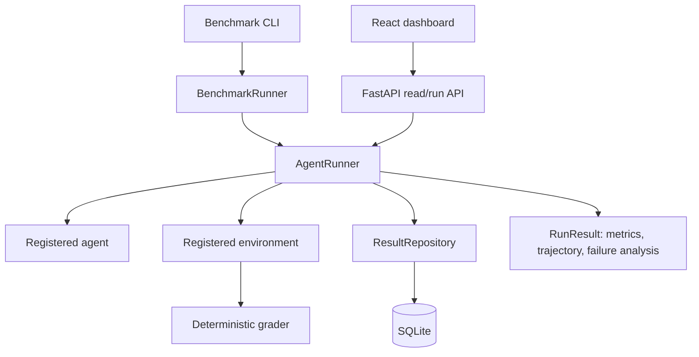

# OpenEnv Workbench

OpenEnv Workbench is a small, deterministic evaluation platform for testing
agents on realistic, non-game tasks. It gives developers one repeatable
execution path from observation to action, deterministic grading, structured
metrics, trajectory capture, benchmark comparison, persistence, and a focused
React dashboard.

## Why it exists

Agent demos often make it difficult to answer basic engineering questions:
which agent succeeded, which task failed, how many steps were wasted, and what
actually happened before termination? This project makes those questions
observable and testable without requiring an LLM for the default test suite.

## Architecture and execution flow



The core loop is:

```text
environment.reset()
  -> observation
  -> agent.observe(observation)
  -> action validation
  -> environment.step(action)
  -> new observation/reward/info
  -> repeat until completion, limit, timeout, or error
```

## Environments and tasks

The original OpenEnv environment includes:

- **Email Classification** (`email_classification`, easy)
- **Data Cleaning** (`data_cleaning`, medium)
- **Customer Support** (`customer_support_reply`, hard)

The controlled coding environment includes deterministic Python bug-fixing
tasks:

- `fix_addition`
- `fix_email_normalization`
- `fix_safe_division`

Coding actions are restricted to `list_files`, `read_file`, `edit_file`,
`run_tests`, and `submit`. It does not accept arbitrary shell commands or host
filesystem paths.

## Agents and LLM architecture

Agents implement the small `observe(observation) -> action` interface.
`MockAgent` returns predefined actions and is used for deterministic tests.
`LLMBackedAgent` uses the provider-neutral `LLMProvider` interface.
`OpenAIProvider` is the current OpenAI-compatible provider implementation.
Credentials are read from environment variables and are never written to
results or logs.

## AgentRunner

`AgentRunner` is independently usable from Python and supports synchronous
and asynchronous agents/environments. It validates actions, enforces
`max_steps`, supports cooperative overall timeouts, handles cancellation in
async runs, and returns a structured `RunResult`.

Each result includes:

- completion and termination reason
- final observation/action
- grading summary
- execution metrics
- agent/environment errors
- model and token metadata when provided
- every interaction as a structured trajectory
- deterministic failure categories and primary failure reason

## Deterministic grading and failure analysis

Environment graders produce normalized scores and breakdowns. The runner does
not ask an LLM to judge failures. Failure categories are derived from
validated runner/environment facts, including invalid actions, agent errors,
environment errors, constraint violations, incorrect output, incomplete
tasks, timeouts, and repeated failed actions.

## Benchmarks and multi-agent comparison

`BenchmarkRunner` runs one or more tasks repeatedly through `AgentRunner`.
Configurations specify the environment, tasks, registered agent(s), step
limit, timeout, run count, and optional seed. Aggregates include success rate,
average score, average steps, average execution time, failure rate, timeout
rate, failure categories, repeated actions, and wasted steps.

Multiple registered agents can be compared on the same tasks and evaluation
settings. Results can be exported to JSON or CSV.

Example:

```bash
python -m benchmark.cli run \
  --environment openenv \
  --tasks email_classification \
  --agents mock \
  --runs 2 \
  --actions mock-actions.json \
  --output-json results.json \
  --output-csv results.csv
```

The project does not claim benchmark scores here: scores depend on the
provided actions, task configuration, and optional provider responses.

## Persistence

`storage.ResultRepository` provides SQLite persistence independent of
`AgentRunner` and environment implementations. It stores benchmark metadata,
individual task records, agents/models, scores, metrics, trajectories, failure
analysis, termination reasons, and timestamps.

```python
from benchmark import BenchmarkConfig, BenchmarkRunner
from storage import ResultRepository

repository = ResultRepository("openenv_results.db")
benchmark = BenchmarkRunner(repository=repository).run(
    BenchmarkConfig(
        environment="openenv",
        task_ids=["email_classification"],
        agent="mock",
        actions={"email_classification": [...]},
    )
)
stored = repository.get_benchmark(benchmark.benchmark_run_id)
```

The API persists controlled `/runs` executions when
`OPENENV_RESULTS_DB` is configured. SQLite is intended for local development
and single-service deployments, not high-concurrency production workloads.

## Dashboard

The React/Vite dashboard is in `frontend/`. It reads data only through
FastAPI, never through SQLite. It provides summary metrics, agent/model
comparison, environment/task performance, benchmark history, filters,
individual run details, trajectory inspection, and failure analysis.

## Installation and configuration

Backend:

```bash
python -m venv .venv
# Windows:
.venv\Scripts\activate
# macOS/Linux:
# source .venv/bin/activate
pip install -r requirements.txt
copy .env.example .env  # Windows
# cp .env.example .env  # macOS/Linux
uvicorn environment.app:app --reload
```

Frontend:

```bash
cd frontend
npm ci
npm run dev
```

Configuration is documented in [.env.example](.env.example):

- `OPENENV_RESULTS_DB`: SQLite path, default `./openenv_results.db`
- `CORS_ORIGINS`: comma-separated allowed browser origins
- `OPENENV_BASIC_AUTH_USERNAME` and `OPENENV_BASIC_AUTH_PASSWORD`: optional
  HTTP Basic credentials for protected API/result routes. `/health` remains
  public.
- `OPENENV_BASIC_AUTH_USERS`: optional comma-separated additional
  `username:password` entries for small shared deployments.
- `OPENAI_API_KEY` or `HF_TOKEN`: optional provider credential
- `API_BASE_URL`: optional OpenAI-compatible API base
- `MODEL_NAME`: optional provider model name

Never commit `.env` or credential values.

When both Basic Auth variables are set, the dashboard displays an in-memory
sign-in form. Credentials are sent only in request headers and are not
persisted in browser storage.

## Docker

Start the API and dashboard together:

```bash
docker compose up --build
```

- API: `http://localhost:8000`
- Dashboard: `http://localhost:3000`
- Health: `http://localhost:8000/health`

The SQLite file is stored in the named `openenv-data` volume. For API-only
use:

```bash
docker build -t openenv-workbench .
docker run --rm -p 8000:8000 -v openenv-data:/data \
  -e OPENENV_RESULTS_DB=/data/openenv_results.db openenv-workbench
```

## API

Important routes:

- `GET /health`
- `POST /reset`, `POST /step`, `GET /state`
- `POST /runs`
- `GET /results/benchmarks`
- `GET /results/benchmarks/{benchmark_run_id}`
- `GET /results/runs`
- `GET /results/runs/{run_id}`
- `GET /results/agents/{agent}`
- `GET /results/environments/{environment}`

The result-list route accepts `agent`, `environment`, `task`,
`benchmark_run`, `difficulty`, and `limit` filters.

## Tests and verification

Backend:

```bash
pytest -q
```

Frontend:

```bash
cd frontend
npm ci
npm run build
```

CI runs backend tests and the frontend production build on pushes and pull
requests using [.github/workflows/ci.yml](.github/workflows/ci.yml).

## Project structure

```text
agent/       agent interfaces, providers, runner, result models
benchmark/   benchmark configuration, aggregation, CLI, exports
coding/      sandboxed Python coding environment and tasks
environment/ OpenEnv implementation and FastAPI API
storage/     SQLite repository/data-access layer
tasks/       deterministic task definitions and graders
frontend/    React/Vite dashboard
tests/       backend unit and integration tests
```

## Limitations and future work

- SQLite is a lightweight local persistence option, not a distributed
  database.
- Synchronous blocking calls cannot be forcefully interrupted by
  `run_async`.
- The dashboard is read-focused and has no write controls. Optional HTTP
  Basic authentication protects API/result routes; this is shared-credential
  access, not a full identity or account-management system.
- There is no dashboard editing, scheduling, distributed execution,
  multi-model UI configuration, or failure-analysis model.
- Future work can add stronger deployment hardening, richer dashboard
  visualizations, database migrations, and authenticated multi-user access.
